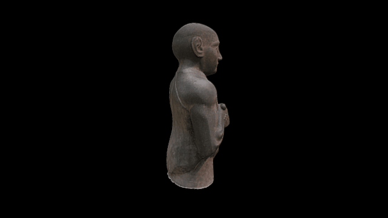

 
# A 3D model of the statue of Gudea

3D data for recreation of a British Museum object.

Upper part of standing figure with head; carved and polished mottled green dolerite; but neck restored. Gudea was the ruler of the city-state of Lagash. 

One of a dynasty of rulers in southern Mesopotamia who expanded their authority following the collapse of the Akkadian empire around 2190 BC. Lagash was eventually absorbed into the kingdom of the Third Dynasty of Ur after 2100 BC.

Circa 2130 BC.
Dimensions
Height: 78 centimetres Width: 50 centimetres Depth: 31 centimetres
Weight: 150 kilograms

Full record: http://bit.ly/gudeaBM

# LICENSE
The contents of this repository are licensed under CC-BY-NC-SA

# Credits
Photographs and models by Daniel Pett <dpett@britishmuseum.org> with a Canon 700D, Digital Humanities Lead, British Museum
